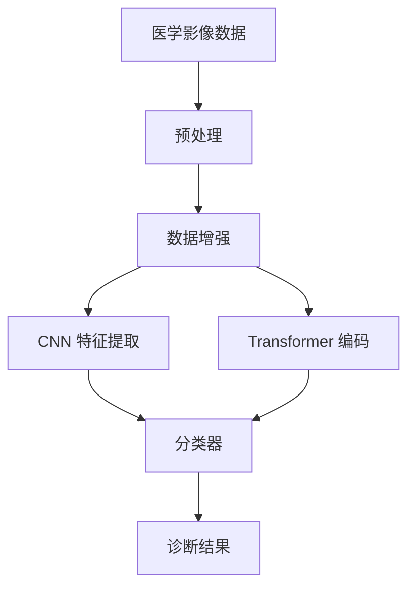

# 深度学习在医学影像诊断中的应用综述

> 课程：人工智能导论 · 学期：2024-2025 第二学期

---

## 摘要

深度学习技术在医学影像诊断领域取得了突破性进展。本文综述了卷积神经网络（CNN）、Transformer 架构在医学影像分析中的应用现状，分析了主流方法的优势与局限，并展望了未来发展方向 [@he2016deep]。

## 第一章 引言

医学影像是现代医疗诊断的重要工具。随着深度学习技术的发展，AI 辅助诊断系统在放射学、病理学等领域展现出巨大潜力 [@litjens2017survey]。本章介绍研究背景和论文结构。

## 第二章 技术架构

## 第三章 关键方法对比

| 方法 | 准确率 | 参数量 | 训练时间 | 适用场景 |
|------|--------|--------|----------|----------|
| ResNet-50 | 92.3% | 25.6M | 4h | 通用分类 |
| DenseNet-121 | 93.1% | 8.0M | 6h | 细粒度分类 |
| ViT-B/16 | 94.5% | 86.0M | 12h | 大样本分类 |
| Swin Transformer | 95.2% | 88.0M | 10h | 多尺度检测 |

## 第四章 结论

深度学习方法在医学影像诊断中已取得显著成果，但仍面临数据标注成本高、模型可解释性不足等挑战。未来研究方向包括少样本学习、多模态融合和联邦学习 [@ronneberger2015u]。

---

## 参考文献

<!-- AI 将根据 references.bib 自动生成格式化参考文献列表 -->